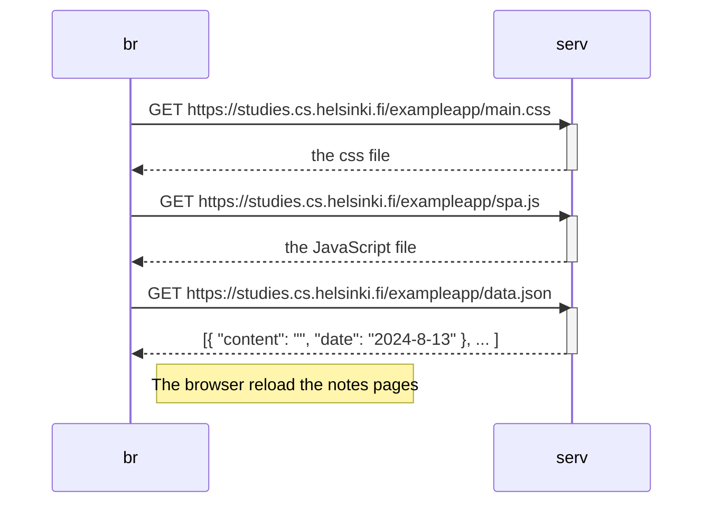

```mermaid
  sequenceDiagram
      participant br
      participant serv

      br->>serv: GET https://studies.cs.helsinki.fi/exampleapp/main.css
      activate serv
      serv-->>br: the css file
      deactivate serv
  
      br->>serv: GET https://studies.cs.helsinki.fi/exampleapp/spa.js
      activate serv
      serv-->>br: the JavaScript file
      deactivate serv

      br->>serv: GET https://studies.cs.helsinki.fi/exampleapp/data.json
      activate serv
      serv-->>br: [{ "content": "", "date": "2024-8-13" }, ... ]
      deactivate serv

      Note right of br: The browser reload the notes pages

```
